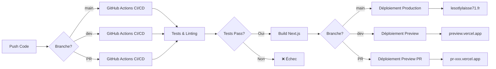

# 🚀 Résumé Configuration Vercel - lesotlylaisse71.fr

**Date**: 2025-01-06  
**Statut**: ✅ Configuré et Opérationnel

## 📋 Configuration Actuelle

### Environnements

| Environnement | Branche | URL | Status |
|---------------|---------|-----|--------|
| **Production** | `main` | https://lesotlylaisse71.fr | ✅ Actif |
| **Preview** | `dev` | Auto-généré | ✅ Actif |
| **Pull Requests** | Toutes | Auto-généré | ✅ Actif |

### Domaine Personnalisé

- **Domaine Principal**: lesotlylaisse71.fr
- **Registrar**: Third Party
- **Nameservers**: Vercel
- **SSL/TLS**: ✅ Automatique (Let's Encrypt)
- **HTTPS**: ✅ Forcé

### Variables d'Environnement Configurées

✅ Toutes configurées sur Vercel pour tous les environnements:
- `HYGRAPH_TOKEN`
- `NEXT_PUBLIC_HYGRAPH_URL`
- `CODECOV_TOKEN` (optionnel)

## 🔄 Flux de Déploiement



## 🛠️ Workflows GitHub Actions

### CD Pipeline (.github/workflows/cd.yml)
- ✅ Déploie automatiquement sur Vercel
- ✅ Ajoute les métadonnées de commit
- ✅ Distingue Production (main) et Preview (dev)
- ✅ Crée un résumé de déploiement

### CI Pipeline (.github/workflows/ci.yml)
- ✅ Linting avec ESLint
- ✅ Format check avec Prettier
- ✅ Type checking avec TypeScript
- ✅ Tests avec Jest
- ✅ Upload coverage vers Codecov

### Lighthouse CI (.github/workflows/lighthouse-ci.yml)
- ✅ Audits de performance
- ✅ Tests d'accessibilité
- ✅ Best practices
- ✅ SEO

## 📊 Métriques et Monitoring

- **Vercel Analytics**: Automatique
- **Lighthouse CI**: Chaque déploiement
- **Codecov**: Couverture de code
- **GitHub Actions**: Status des builds

## ✅ Checklist Configuration

- [x] Domaine personnalisé configuré
- [x] SSL/TLS actif
- [x] Production branch = main
- [x] Preview branch = dev
- [x] Pull Requests déploiements activés
- [x] Variables d'environnement configurées
- [x] GitHub Actions workflows configurés
- [x] Bun comme runtime
- [x] Métadonnées de déploiement
- [x] Monitoring activé

## 🎯 URLs Importantes

### Dashboard Vercel
- **Projet**: https://vercel.com/ujju16s-projects/lesotlylaisse71
- **Settings**: https://vercel.com/ujju16s-projects/lesotlylaisse71/settings
- **Git**: https://vercel.com/ujju16s-projects/lesotlylaisse71/settings/git
- **Domains**: https://vercel.com/ujju16s-projects/lesotlylaisse71/settings/domains
- **Environment Variables**: https://vercel.com/ujju16s-projects/lesotlylaisse71/settings/environment-variables

### GitHub
- **Repository**: https://github.com/ujju16/lesotlylaisse71
- **Actions**: https://github.com/ujju16/lesotlylaisse71/actions
- **Settings**: https://github.com/ujju16/lesotlylaisse71/settings

### Site Web
- **Production**: https://lesotlylaisse71.fr
- **Vercel URL**: https://lesotlylaisse71.vercel.app

## 🔧 Commandes Utiles

```bash
# Vérifier les déploiements
vercel ls --yes

# Vérifier les domaines
vercel domains ls

# Vérifier les variables d'environnement
vercel env ls

# Lancer un déploiement manuel en production
bun run vercel:deploy:prod

# Lancer un déploiement preview
bun run vercel:deploy:preview

# Vérifier la configuration
bun run vercel:check

# Voir les logs d'un déploiement
vercel logs [deployment-url]

# Promouvoir un preview en production
vercel promote [deployment-url]
```

## 📝 Prochaines Actions

### Optimisations à Faire
1. ✅ Configuration de base terminée
2. 🔄 Améliorer le design Material UI (en cours)
3. 🔄 Implémenter l'authentification admin
4. 🔄 Connecter Hygraph CMS
5. 🔄 Ajouter des tests e2e avec Playwright

### Maintenance
- Surveiller les métriques Vercel Analytics
- Vérifier régulièrement les audits Lighthouse
- Maintenir la couverture de code > 80%
- Mettre à jour les dépendances régulièrement

## 🐛 Problèmes Connus à Résoudre

1. **Design monotone** → Améliorer avec Material Design v3
2. **Erreur Hygraph permissions** → Configurer les permissions sur le schema `image`
3. **ARIA labels** → Ajouter sur tous les composants interactifs

## 📚 Documentation

- [Configuration Vercel](./VERCEL_DEPLOYMENT.md)
- [Configuration Domaine](./DOMAIN_CONFIGURATION.md)
- [Plan Admin CRUD](../../PLAN-ADMIN-CRUD.md)
- [Documentation Hygraph](./hygraph/)

## 🎉 Statut Final

**Configuration Vercel: ✅ TERMINÉ**

Tous les déploiements sont correctement nommés et configurés:
- ✅ Production (main) → lesotlylaisse71.fr
- ✅ Preview (dev) → URL preview Vercel
- ✅ Pull Requests → URLs preview uniques
- ✅ Métadonnées de commit ajoutées
- ✅ Monitoring configuré

**Le projet est prêt pour le développement de la page admin!** 🚀
